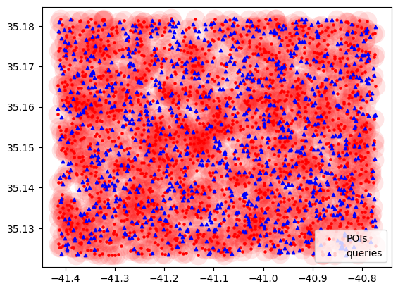

# RiskAwarePOIRecommender

We provide below a step-by-step set of examples in order to use the following recommendation models:
- **random**: this model recommends *K* POIs selected unifformly att random from the set of eligible ones
- **closest**: this model recommends *K* POIs based on proximity, where a POI located closer to the location of each 
  individual is preferred to a POI located further away
- **local**: this model recommends *K* POIs following a locally optimal risk-aware recommendation model presented in 
  the paper. It represents the current state of practice approach.
- **global**: this model recommends *K* POIs following our proposed globally optimal risk-aware recommendation model 

We can not share the real-world mobility data from SafeGraph. 
You can gain accesss to *Patterns*, *Geometry* and *Places* datasets, from 
[Advan](https://advanresearch.com) and [SafeGraph](https://www.safegraph.com).  

In the following set of experiments, we work on synthetic POIs over an unoccupied area in order to redirect the 
focus of our experiments to the performance of the above models. As such, we came up with an anonymous city named 
*test_city*. 

#### Step 1: generate *test_city*'s layout

`setup.ipynb`: generates test_city's POI layout, user queries, and outputs figures under *files/img/test_city*.

* we randomly arranged 1,000 POIs 
* we simulate 100 random queries per second for a total of 2,000 queries (20 seconds).
* these parameters can be updated in *setup.ipynb*

Below is a figure for a working example for test_city:

#### Step 2: go over working examples focusing on model's usibility

`example.ipynb`: provides various use cases and demonstrations on how to use the different recommendation models.
More specifically,
* it shows how to set K, invocation frequecy, and duration of experiment
* it currently supports invocation frequencies of 1, 1/2, 1/4, 1/8 and 1/10 Hz. However, these values can be manually 
  changed in `setup.ipynb` under *rearrange queries to represent different invocation frequencies*
* results can be saved by calling *rec.save(SAVE_TO)*
* get the updated POI occupancies results by calling *rec.get_POIs()['avg_visits']
* get the recommendations for each user by calling *rec.get_top_k()*

